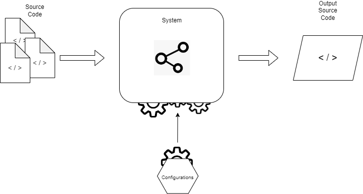
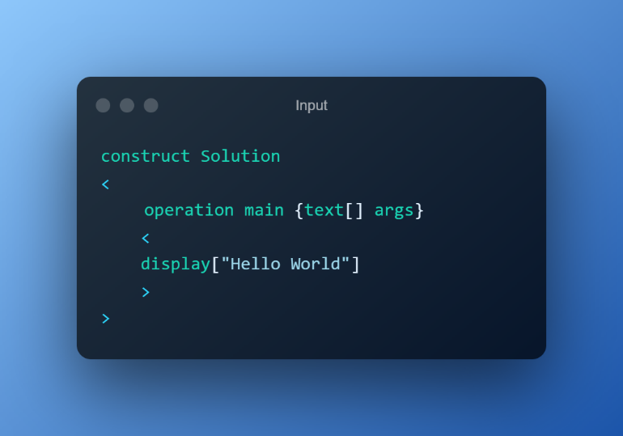
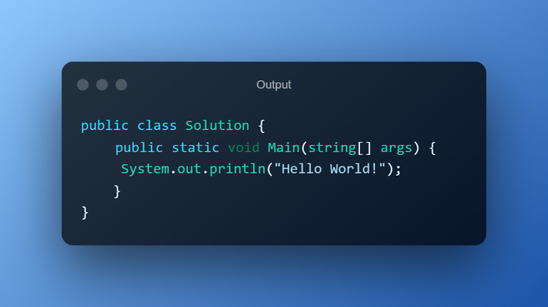
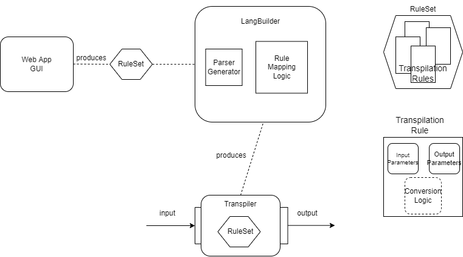

# Introduction

Welcome to my bachelor's thesis project entitled **'Automated Transpiler Generation'**.
This project explores the concept of metaprogramming and the creation of transpilers that can automatically convert code from one programming language to another. As a software developer, I have always been fascinated by the idea of using code to write code, and this project allowed me to delve deeper into this topic. In this repository, you will find the source code and documentation for my thesis project, as well as any additional materials related to my research. I hope you find this project interesting and informative, and I welcome any feedback or questions you may have.

## Structure

```
├── Automated Transpiler Generation.docx - full paper on the topic
└── src
    ├── Antlr - directory containing ANTLR executable
    ├── dotNet - .NET Core API
    ├── react - React frontend for presentation purposes only
    └── .gitignore
```

### Application Function

The simplified goal of the system is show in this diagram.



To give a particular example, the goal of the system is to transform an input code such as



to an output code looking like this



## Workflow Example

1. Create a JSON **RuleSet** manually or using the React UI
2. Post the **RuleSet** to the Generate Endpoint in the C# API
3. The Endpoint returns an Executable DotNet Console Application - the **Transpiler**
4. Run the **Transpiler** using `dotnet .\javaLikeTranspiler.exe -i input-code.jl -o output.java`

### Current Implementation



The diagram above reflects the different parts of the current implementation.

To summarize:
- The **LangBuilder** is a .NET Core ASP.NET application
- The **Transpiler** is a .NET Core Console Application
- The **RuleSet** is a JSON object
- The Web App GUI is a React application generating a JSON file

Extra details:
- The **LangBuilder** *generates* a **Transpiler** application which is then run *completely detached* from the **LangBuilder**. It is a separate application.
- The **Transpiler** is generated using a template .NET Core Console Application, which is modified by the **LangBuilder** using **Roslyn**. 
- A C# Parser is automatically generated by **ANTLR**, which is executed by the **LangBuilder** as a Process. The Parser is then inserted into the **Transpiler** using **Roslyn**, and based on the **RuleSet**, processing logic is dynamically generated and inserted into the **Transpiler**.
- The **Transpiler** is then compiled, and a `.runtimeconfig.json` is generated for it.


```json
{
  "name": "JavaLike",
  "rules": [
    {
      "name": "constructKeyword",
      "type": "DirectTranslation",
      "inputSymbol": "construct",
      "outputSymbol": "public class"
    },
    {
      "name": "label",
      "type": "Expression",
      "expression": "Label"
    },
    {
      "name": "curlyBraceStart",
      "type": "DirectTranslation",
      "inputSymbol": "<",
      "outputSymbol": "{"
    },
    {
      "name": "curlyBraceEnd",
      "type": "DirectTranslation",
      "inputSymbol": ">",
      "outputSymbol": "}"
    },
    {
      "name": "constructDeclaration",
      "type": "RuleSequence",
      "rules": [
        "constructKeyword",
        "label",
        "curlyBraceStart",
        "operationDeclaration",
        "curlyBraceEnd"
      ],
      "isStatement": true,
      "delimiter": " "
    },
    {
      "name": "operationKeyword",
      "type": "DirectTranslation",
      "inputSymbol": "operation",
      "outputSymbol": "public static void"
    },
    {
      "name": "parameterBraceStart",
      "type": "DirectTranslation",
      "inputSymbol": "{",
      "outputSymbol": "("
    },
    {
      "name": "parameterBraceEnd",
      "type": "DirectTranslation",
      "inputSymbol": "}",
      "outputSymbol": ")"
    },
    {
      "name": "arrayBraces",
      "type": "DirectTranslation",
      "inputSymbol": "[]",
      "outputSymbol": "[]"
    },
    {
      "name": "parameterTypeText",
      "type": "DirectTranslation",
      "inputSymbol": "text",
      "outputSymbol": "String"
    },
    {
      "name": "parameterTypeNumber",
      "type": "DirectTranslation",
      "inputSymbol": "number",
      "outputSymbol": "long"
    },
    {
      "name": "parameterType",
      "type": "RuleOptionSequence",
      "delimiter": "",
      "rules": ["parameterTypeText", "parameterTypeNumber"]
    },
    {
      "name": "parameterTypeArray",
      "type": "RuleSequence",
      "delimiter": "",
      "rules": ["parameterType", "arrayBraces"]
    },
    {
      "name": "parameterTypeArrayWithLabel",
      "type": "RuleSequence",
      "delimiter": " ",
      "rules": ["parameterTypeArray", "label"]
    },
    {
      "name": "parameterDeclaration",
      "type": "RuleSequence",
      "delimiter": "",
      "rules": [
        "parameterBraceStart",
        "parameterTypeArrayWithLabel",
        "parameterBraceEnd"
      ]
    },
    {
      "name": "operationDeclaration",
      "type": "RuleSequence",
      "delimiter": " ",
      "rules": [
        "operationKeyword",
        "label",
        "parameterDeclaration",
        "curlyBraceStart",
        "displayStatement",
        "curlyBraceEnd"
      ]
    },
    {
      "name": "displayKeyword",
      "type": "DirectTranslation",
      "inputSymbol": "display",
      "outputSymbol": "System.out.println"
    },
    {
      "name": "displayText",
      "type": "Expression",
      "expression": "'\"' (~'\"')+ '\"'"
    },
    {
      "name": "displayBraceStart",
      "type": "DirectTranslation",
      "inputSymbol": "[",
      "outputSymbol": "("
    },
    {
      "name": "displayBraceEnd",
      "type": "DirectTranslation",
      "inputSymbol": "]",
      "outputSymbol": ");"
    },
    {
      "name": "displayStatement",
      "type": "RuleSequence",
      "rules": [
        "displayKeyword",
        "displayBraceStart",
        "displayText",
        "displayBraceEnd"
      ]
    }
  ]
}
```

### Planned Features

- More Predefined Transpilation Rules
- Support for Calculations based on Rule Inputs
- Better Parsing

